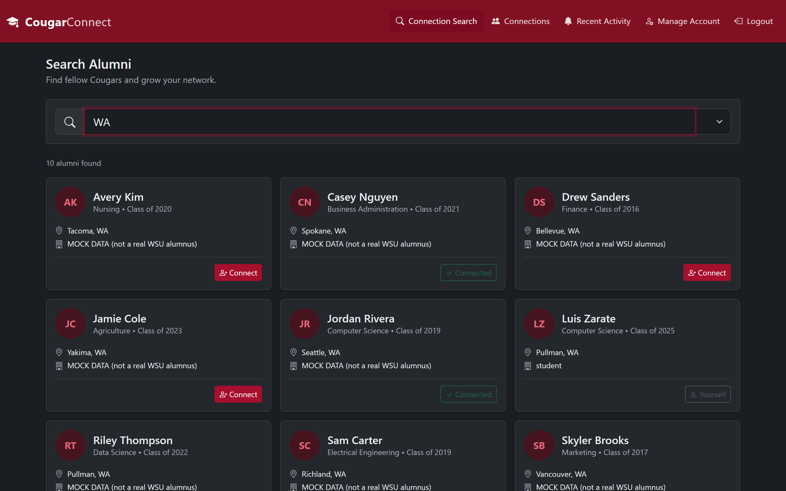
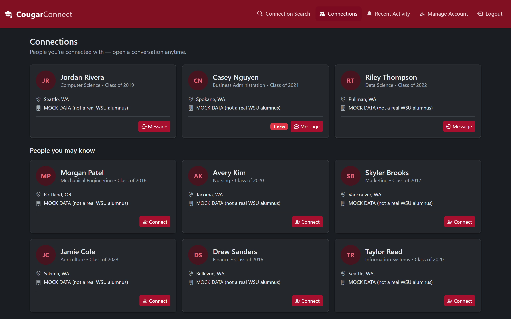
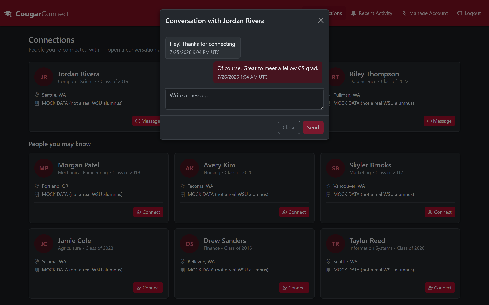
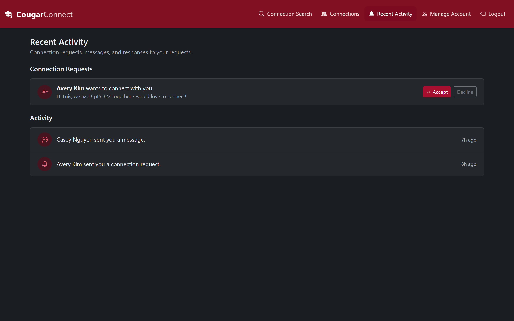
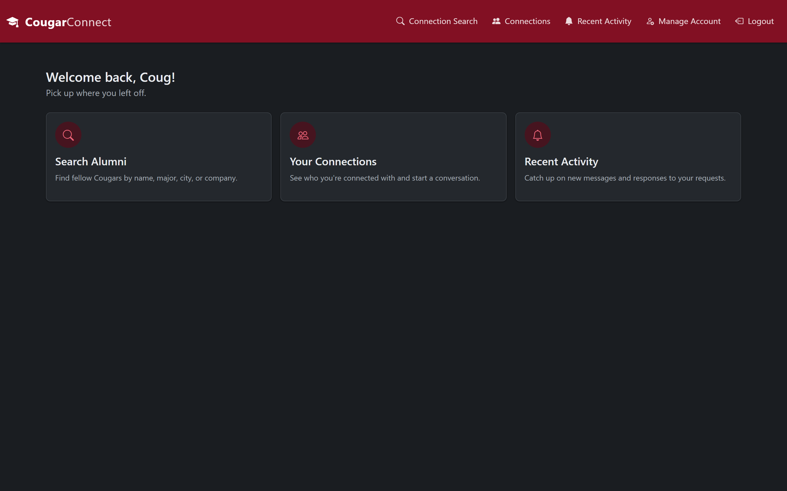
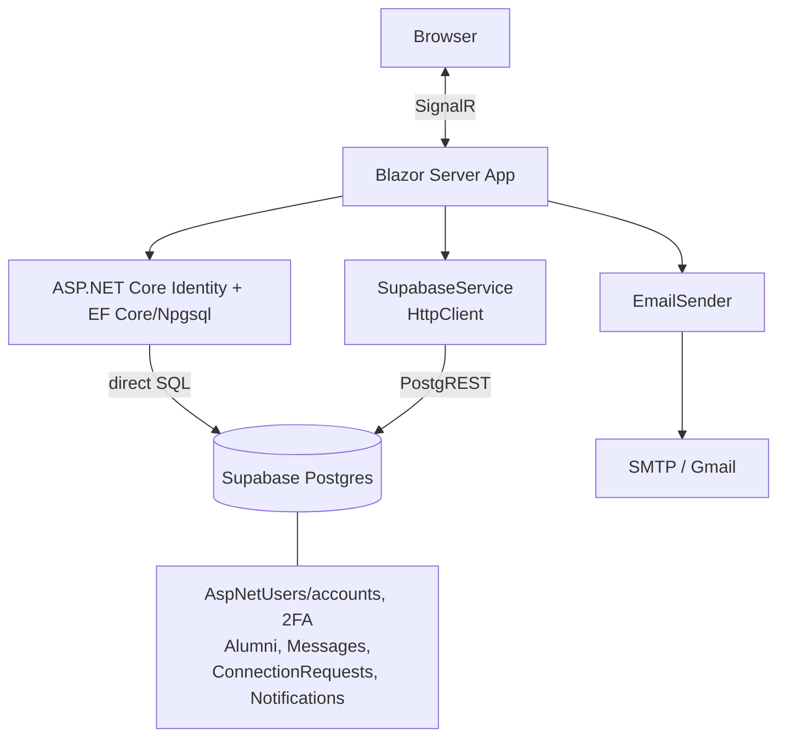

# CougarConnect

> Alumni networking platform for WSU alumni — search graduates, send connection requests, and message the people you connect with.

[](https://cougarconnect.onrender.com/Account/Login)
[](https://github.com/LuisZarate17/AlumniNetwork/actions/workflows/ci.yml)


**🔗 [Live demo](https://cougarconnect.onrender.com/Account/Login)** — sign in with **`demo@cougarconnect.demo`** / **`Demo123!`** (credentials also shown on the login page). Hosted on Render's free tier, so the first load after a period of inactivity takes ~50 seconds to wake up.

CougarConnect is a web platform that helps WSU alumni find each other and stay in touch with their alma mater. A single search box matches graduates across name, graduation year, city, major, and company; users send connection requests, exchange messages once connected, and get recommendations for people they may know.

## Screenshots

**Alumni search** — one box matches across name, major, city, company, and grad year, with live connection status on every result:



| Connections & recommendations | Direct messaging |
|:---:|:---:|
|  |  |
| **Recent activity** | **Dashboard** |
|  |  |

> The screenshots above run against local mock data — every profile is clearly labeled as such, not a real WSU alumnus.

## Features

- **Alumni search** — one search box matches across name, grad year, city, major, and company (case-insensitive partial match), so you don't have to pick a field first.
- **Connection requests** — send a request with a subject and message; the recipient accepts or declines in-app on the Recent Activity page or via a tokenized link emailed to them.
- **Direct messaging** — once two alumni connect, they can exchange messages one-on-one, with unread indicators surfaced on the Connections page.
- **People you may know** — recommendations built from the alumni directory, excluding yourself and people you're already connected to.
- **Notifications & recent activity** — a running feed of incoming requests and updates.
- **Secure accounts** — registration with email verification and optional two-factor authentication, built on ASP.NET Core Identity.

## Architecture

CougarConnect is a Blazor Server app: the browser holds a persistent SignalR connection to the server, which renders interactive components. A single **Supabase Postgres** database sits behind it, reached two ways — **ASP.NET Core Identity via EF Core (Npgsql)** handles accounts, sign-in, and 2FA in its own tables, while the alumni domain data (profiles, messages, connection requests, notifications) is reached over Supabase's **PostgREST** API via `HttpClient` in [`SupabaseService`](CougarConnect/CougarConnect/Services/SupabaseService.cs). Transactional email (account confirmation, connection-request links) is sent over SMTP.



## Getting Started

### Prerequisites
- [.NET 8 SDK](https://dotnet.microsoft.com/download/dotnet/8.0)
- A PostgreSQL database for ASP.NET Core Identity's account tables — a local Postgres instance, or a [Supabase](https://supabase.com) project (the same one below can serve both Identity and the alumni data)
- A [Supabase](https://supabase.com) project for the alumni search/connections features. Run [`supabase/schema.sql`](supabase/schema.sql) (and optionally [`supabase/seed.sql`](supabase/seed.sql)) in its SQL Editor; see [`supabase/README.md`](supabase/README.md) for details. The Identity tables are created automatically on startup.

### Setup
1. Clone the repo.
2. Provide configuration — either copy `CougarConnect/CougarConnect/appsettings.Example.json` to `CougarConnect/CougarConnect/appsettings.json` and fill in real values, or use `dotnet user-secrets` (recommended, keeps real values out of any tracked file):
   ```
   cd CougarConnect/CougarConnect
   dotnet user-secrets set "ConnectionStrings:DefaultConnection" "Host=localhost;Port=5432;Database=cougarconnect;Username=postgres;Password=postgres"
   dotnet user-secrets set "Supabase:Url" "https://your-project.supabase.co"
   dotnet user-secrets set "Supabase:ApiKey" "your-supabase-api-key"
   dotnet user-secrets set "Email:SmtpHost" "smtp.gmail.com"
   dotnet user-secrets set "Email:SmtpPort" "587"
   dotnet user-secrets set "Email:FromAddress" "your-app-email@gmail.com"
   dotnet user-secrets set "Email:AppPassword" "your-gmail-app-password"
   ```
   See the Configuration table below for what each key means.
3. Trust the local HTTPS development certificate (the app enforces HTTPS redirection):
   ```
   dotnet dev-certs https --trust
   ```
4. The Identity account tables are created automatically on startup (the app applies any pending EF Core migrations against the configured database). To create them ahead of time instead, run:
   ```
   dotnet tool install --global dotnet-ef
   dotnet ef database update --project CougarConnect/CougarConnect
   ```
5. Run the app:
   ```
   dotnet run --project CougarConnect/CougarConnect
   ```

## Configuration

The app reads its configuration from `CougarConnect/CougarConnect/appsettings.json`, which is gitignored since it holds real secrets. Copy `appsettings.Example.json` in the same folder to `appsettings.json` (or use `dotnet user-secrets` / `appsettings.Development.json`) and fill in real values — never commit real secrets.

| Key | Purpose |
|---|---|
| `ConnectionStrings:DefaultConnection` | PostgreSQL (Npgsql) connection string used by ASP.NET Core Identity for account storage (login, registration, 2FA). For Supabase, use the **Session pooler** string from Project Settings > Database. |
| `Email:SmtpHost` / `Email:SmtpPort` | SMTP server used to send account-confirmation and connection-request emails (defaults: `smtp.gmail.com` / `587`). |
| `Email:FromAddress` | The email address emails are sent from. |
| `Email:AppPassword` | Must be a Gmail **App Password**, not your real account password — generate one at https://myaccount.google.com/apppasswords (requires 2-Step Verification enabled). |
| `Supabase:Url` | The REST endpoint for your Supabase project (e.g. `https://your-project.supabase.co`), found under Project Settings > API. |
| `Supabase:ApiKey` | The Supabase API key used to authenticate REST calls to the `Alumni` table, also found under Project Settings > API. |

## Running Tests

```
dotnet test CougarConnect/CougarConnect.sln
```

Covers unit tests for `SupabaseService` (Supabase query/URL construction, connection de-duplication logic, a regression test for a past request-header leak) and `Alumni`'s JSON wire-format mapping, plus an integration test that exercises the real login flow end-to-end (via `WebApplicationFactory` with EF Core's in-memory provider, so no PostgreSQL database is required to run the suite itself).

Every push and pull request runs this suite on GitHub Actions ([`.github/workflows/ci.yml`](.github/workflows/ci.yml)) — see the CI badge at the top.

## Deployment

The [live demo](https://cougarconnect.onrender.com/Account/Login) runs as a Docker container on [Render](https://render.com)'s free tier, backed by the Supabase Postgres database described above. The [`Dockerfile`](Dockerfile) publishes the Blazor Server app; on startup it applies the Identity EF Core migrations and (when `DemoData:Seed` is set) seeds the ready-to-use demo account. Configuration — the Supabase connection string, anon key, and demo flag — is supplied through the host's environment variables, never committed. A [`render.yaml`](render.yaml) blueprint documents the service definition.
